# 🏛️ System Architecture — OCCASION (HydraRanger Team, Group 3)

เอกสารนี้อธิบายสถาปัตยกรรมระบบ รูปแบบการจัดวางโค้ด และการไหลของข้อมูล (Data Flow) ในโปรเจกต์ Sprint 2

---

## 🏗️ 1. High-Level Architecture

ระบบถูกออกแบบเป็น **Decoupled Multi-Client Architecture** โดยหน้าร้านลูกค้าและระบบ
Admin เป็นคนละเว็บไซต์ แต่ใช้ Backend และฐานข้อมูลร่วมกัน:

```mermaid
graph TD
    Client["Customer Client (React + Vite :5173)"] -- "Customer REST API" --> Server["Backend (Express.js API)"]
    AdminClient["Admin Client (React + Vite :5174)"] -- "Admin REST API" --> Server
    
    subgraph Customer Frontend Layer
        Routes["Routes (AppRoutes)"]
        Pages["Pages (HomePage, Dashboard, Login)"]
        Components["Components (Navbar, Card, Button)"]
        Services["API Client / Services"]
        Routes --> Pages
        Pages --> Components
        Pages --> Services
    end

    subgraph Admin Frontend Layer
        AdminLogin["Admin Login"]
        AdminDashboard["Admin Dashboard"]
        AdminService["Admin API Service + Separate Token"]
        AdminLogin --> AdminService
        AdminDashboard --> AdminService
    end

    subgraph Backend Layer
        App["app.js / server.js"]
        Middlewares["Middlewares (Auth, Error, Logger)"]
        Routers["Routes (/api/auth, /api/admin/auth, /api/items, /api/users)"]
        Controllers["Controllers (Request/Response)"]
        Validators["Validators (Input Validation)"]
        BackendServices["Services (Business Logic)"]
        Models["Models (Data Schemas)"]
        DB[(Database / In-Memory Store)]

        App --> Middlewares
        App --> Routers
        Routers --> Validators
        Routers --> Middlewares
        Routers --> Controllers
        Controllers --> BackendServices
        BackendServices --> Models
        Models --> DB
    end
```

---

## 🔄 2. Backend Layered Pattern (MVC + Service Layer)

สถาปัตยกรรมฝั่ง Server แบ่งออกเป็นชั้นชัดเจนตามหลัก Separation of Concerns (SoC):

1. **Routes Layer (`routes/`)**: กำหนด HTTP Method, Path และผูก Middleware กับ Controller
2. **Middleware Layer (`middleware/`)**: ตรวจสอบสิทธิ์ (Authentication/Authorization), การบันทึก Log, และการจัดการ Error รวม
3. **Validator Layer (`validators/`)**: ตรวจสอบความถูกต้องของ Payload ที่ส่งมาจาก Client ก่อนเข้า Controller
4. **Controller Layer (`controllers/`)**: รับ Request สกัดค่าตัวแปร และส่ง Response กลับไปยัง Client (ไม่มี Business Logic โดยตรง)
5. **Service Layer (`services/`)**: รวมกฎทางธุรกิจ (Business Logic), การคำนวณ, และการประสานงานระหว่าง Model
6. **Model Layer (`models/`)**: กำหนด Schema, Data Types, และคำสั่งในการติดต่อกับ Database

---

## 🌐 3. Frontend Architecture

ฝั่ง Client ใช้ React Component-based Architecture ร่วมกับ Vite:

1. **`src/main.jsx`**: Bootstrapping React DOM Tree
2. **`src/App.jsx`**: Layout Wrapper, Theme Provider, Root Navigation
3. **`src/routes/`**: Centralized routing system พร้อม Protected Route Guard
4. **`src/pages/`**: View/Container components ที่ประกอบด้วย State และการเรียกใช้ Services
5. **`src/components/`**: Reusable UI Components (Dumb/Presentational Components)
6. **`src/services/`**: Centralized Axios/Fetch client พร้อมการแนบ Bearer Token อัตโนมัติ

### Authentication Boundary

- Customer token ใช้ key occasion_token
- Admin token ใช้ key occasion_admin_token
- Customer login ไม่รับบัญชี role admin
- Admin login รับเฉพาะบัญชี role admin
- Public registration สร้าง role user ที่ Backend เท่านั้น
