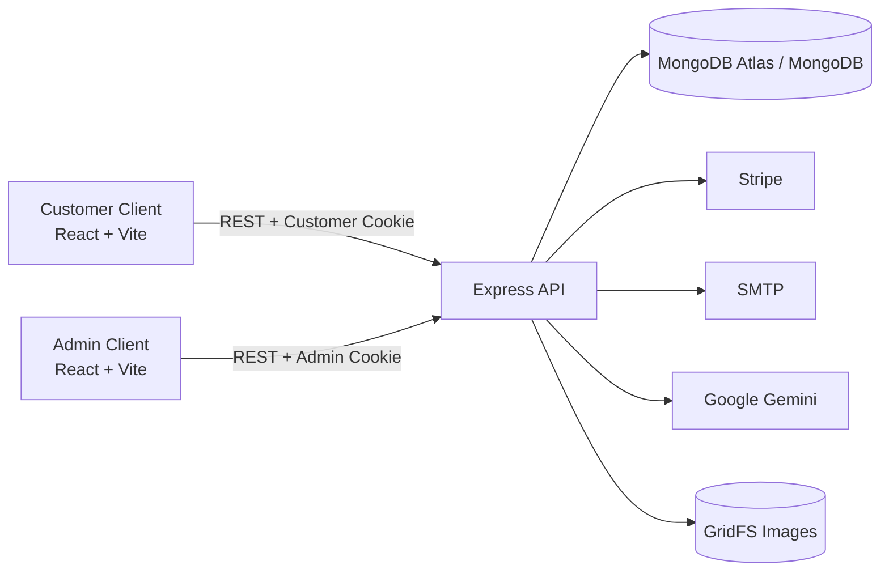
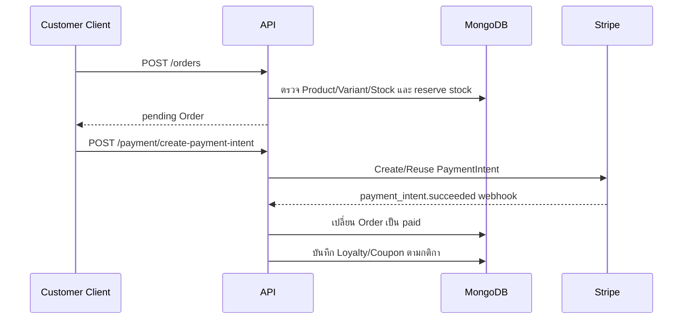

# System Architecture — OCCASION Sprint 3

เอกสารนี้อธิบายโครงสร้างระบบและ data flow ที่มีใน codebase ปัจจุบัน

## ภาพรวม



ระบบเป็น Decoupled Multi-Client Architecture หน้าร้านและ Admin deploy แยกกัน แต่ใช้ API และฐานข้อมูลชุดเดียวกัน

## Frontend

### Customer Client

- React 19, Vite, Tailwind CSS/daisyUI และ React Router
- Zustand และ Context สำหรับ state ที่ต้องใช้ร่วมกัน
- Service layer ส่ง `credentials: include` เพื่อใช้ HttpOnly session cookie
- รองรับ Product/Lookbook, Auth/Profile, Cart/Checkout, Orders, Coupon, Personalized Size Recommendation และ Mix & Match

### Admin Client

- React 19 + Vite แยก port และ deployment จาก Customer Client
- ใช้ Admin session cookie และ protected routes
- จัดการ Dashboard, Product/Variants/Stock/Size Chart, Customer, Order, Lookbook, Article และ Coupon

Review menu/feature ถูกถอดจากระบบปัจจุบัน

## Backend Layers

```text
Request
  → Routes
  → Auth / Role / Rate Limit / Validation Middleware
  → Controllers
  → Services
  → Mongoose Models / External Services
  → Response / Error Handler
```

- Routes กำหนด method, path และ middleware
- Controllers แปลง HTTP request/response
- Services ทำ business rules เช่น stock, loyalty, coupon และ product update
- Models กำหนด MongoDB schema/index
- Error handler ส่ง response รูปแบบเดียวกัน

## Authentication และ Security

- Customer cookie: `occasion_session`
- Admin cookie: `occasion_admin_session`
- Middleware อ่าน cookie หรือ Bearer token แล้วตรวจ role และสถานะบัญชีจากฐานข้อมูล
- Customer/Admin session แยกกันเพื่อลดการใช้สิทธิ์ผิดบริบท
- CORS รับเฉพาะ `CLIENT_URL` และ `ADMIN_CLIENT_URL`; Helmet เพิ่ม security headers
- Login, Register, Password Reset, Upload และ Recommend มี rate limit แยก bucket
- Shared rate limit เก็บใน MongoDB และ fallback เป็น memory เมื่อฐานข้อมูลไม่พร้อม
- Upload ตรวจขนาด, MIME และ file signature ก่อนบันทึก GridFS หรือส่งวิเคราะห์

## Checkout และ Payment Flow



Server อ่านราคาและ stock จากฐานข้อมูล ไม่เชื่อยอดจาก Client และใช้ flags ใน Order ป้องกันการคืน/hัก stock ซ้ำ

## Personalized Size Recommendation

1. Customer บันทึก chest/waist/hips, preferred fit และ Consent ผ่าน `/users/me/size-profile`
2. Product Detail อ่าน `size_chart` ของสินค้า
3. Utility เปรียบเทียบสัดส่วนกับตารางและคืน recommended size, confidence และสถานะ
4. UI แยกความเหมาะสมของไซส์ออกจาก stock ของสี/variant ที่เลือก
5. Admin แก้ `size_chart` พร้อม Product และ script `backfill:size-charts` เติมข้อมูลสินค้า staging รุ่นเก่าได้

ข้อมูล Size Profile เป็นข้อมูลของ Customer คนนั้นและไม่ถูกส่งผ่าน Admin Customer API

## Mix & Match Flow

```text
รูป top/bottom
  → rate limit
  → memory upload (สูงสุด 2 รูป, 5 MB/รูป)
  → ตรวจ MIME + file signature
  → Gemini ตรวจว่าเป็นเสื้อผ้าและวิเคราะห์สี/ประเภท/สไตล์
  → จัดอันดับ Lookbook
  → คืนผล 3 อันดับพร้อมเหตุผล
```

รูปสำหรับ recommendation ไม่ถูกบันทึกถาวร หากไม่ได้ตั้ง `GEMINI_API_KEY` ระบบจะไม่สามารถวิเคราะห์ AI ได้

## Content และ Images

- Product/Article/Admin upload ใช้ GridFS และเรียกอ่านผ่าน `/api/uploads/:id`
- Article ที่ `isPublished=false` ไม่ออกจาก Public API
- Lookbook และ Product ใช้การซ่อนด้วย status แทนการลบข้อมูลธุรกิจทันที

## Deployment

| Layer | Target |
| --- | --- |
| Customer Client | Vercel |
| Admin Client | deployment แยกจาก Customer Client |
| Express API | Render |
| Database/GridFS | MongoDB Atlas |
| Payment | Stripe |
| Email | SMTP |
| AI | Google Gemini |

Environment สำคัญอยู่ใน `server/.env.example`, `client/.env.example` และ `admin-client/.env.example` ห้าม commitค่าจริง

## ขอบเขตและ Legacy

- Cart ยังเป็น client state และไม่มี Cart route/model ฝั่ง Server
- Product flow ใช้ `/products` และ `Product`; scaffold Item CRUD ถูกนำออกแล้ว
- Review feature ถูกถอดแล้ว
- Production readiness ต้องยืนยัน environment, database indexes, email, Stripe webhook, Gemini และ staging data ก่อน deploy
