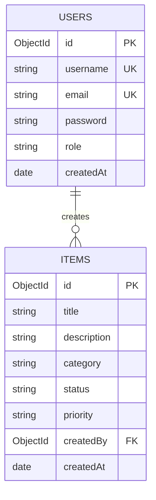

# 🗄️ Database Schema — OCCASION (HydraRanger Team, Group 3)

เอกสารนี้ระบุโครงสร้างฐานข้อมูล คอลเลกชัน (Collections) และฟิลด์ต่างๆ สำหรับ Sprint 2

---

## 📊 Collections Overview

### 1. `users` Collection
เก็บข้อมูลผู้ใช้งานระบบและสิทธิ์การเข้าถึง

| Field Name | Type | Required | Unique | Description |
| :--- | :--- | :--- | :--- | :--- |
| `_id` | ObjectId / String | Yes | Yes | Primary Key |
| `username` | String | Yes | Yes | ชื่อผู้ใช้งาน (3-30 ตัวอักษร) |
| `email` | String | Yes | Yes | อีเมลผู้ใช้งาน (lowercase) |
| `password` | String | Yes | No | รหัสผ่านที่ผ่านการ Hash (bcrypt) |
| `role` | String | Yes | No | สิทธิ์ (`user`, `admin`, `moderator`) default: `user` |
| `avatar` | String | No | No | URL รูปโปรไฟล์ |
| `createdAt` | Date | Yes | No | วันที่สร้างบัญชี |
| `updatedAt` | Date | Yes | No | วันที่แก้ไขข้อมูลล่าสุด |

---

### 2. `items` Collection
เก็บข้อมูลทรัพยากรหลัก/การ์ดกิจกรรมของทีมในระบบ

| Field Name | Type | Required | Unique | Description |
| :--- | :--- | :--- | :--- | :--- |
| `_id` | ObjectId / String | Yes | Yes | Primary Key |
| `title` | String | Yes | No | หัวข้อหรือชื่องาน |
| `description` | String | Yes | No | รายละเอียดงาน |
| `category` | String | Yes | No | หมวดหมู่ (`Design`, `Frontend`, `Backend`, `DevOps`) |
| `status` | String | Yes | No | สถานะ (`Todo`, `In Progress`, `Done`, `Review`) |
| `priority` | String | Yes | No | ความสำคัญ (`Low`, `Medium`, `High`, `Critical`) |
| `createdBy` | ObjectId / String | Yes | No | User ID ผู้สร้างรายการ |
| `createdAt` | Date | Yes | No | วันที่สร้างรายการ |
| `updatedAt` | Date | Yes | No | วันที่แก้ไขรายการล่าสุด |

---

## 🔗 Relationships

