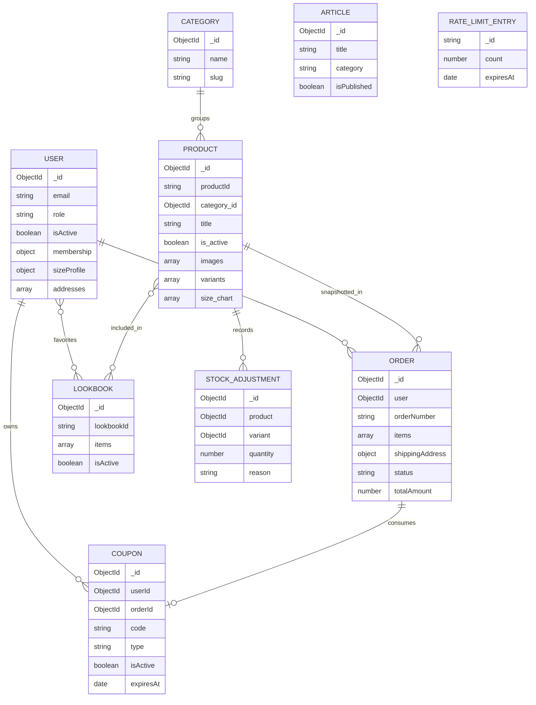

# OCCASION Database Schema — Sprint 3

ระบบใช้ MongoDB ผ่าน Mongoose ข้อมูลหลักอยู่ใน `server/src/models/` เอกสารนี้สรุป model ที่มีในโค้ดปัจจุบัน

## Models

| Model | ฟิลด์สำคัญ | การใช้งาน |
| --- | --- | --- |
| User | username, email, password, role, avatar, birthday, isActive, membership, addresses, favoriteLookbooks, tokenVersion, sizeProfile | Customer/Admin, Profile, Loyalty และ Size Recommendation |
| Product | productId, category_id, title, description, tags, gender, is_active, images, variants, size_chart | Catalog, Stock และ Admin Product |
| Category | name, slug, description, isActive | จัดกลุ่ม Product |
| Lookbook | lookbookId, name, nameTh, concept, occasion, styleTags, imageUrl, items, regularPrice, setPrice, saving, isActive | Lookbook และ Mix & Match result |
| Article | title, excerpt, content, category, imageUrl, author, publishedAt, isPublished | บทความ Public/Admin |
| Order | orderNumber, user, customerEmail, items, shippingAddress, payment fields, totals, couponCode, status, stock flags | Checkout, Payment และ Order History |
| Coupon | code, userId, discountValue, type, minPurchase, eventName, isActive, isUsed, orderId, expiresAt | Welcome และ General Coupon |
| RateLimitEntry | `_id` bucket key, count, expiresAt | ตัวนับ rate limit ร่วมหลาย instance |
| StockAdjustment | product/variant reference, quantity/reason fields | Model สำหรับประวัติการปรับ stock; ยังไม่มี route หลักใน API |

Review model ไม่มีอยู่ในระบบปัจจุบัน

## User

- `role` ใช้ค่าจาก `USER_ROLES`; ผู้สมัครทั่วไปเป็น `user`
- password เก็บเป็น hash และไม่ถูก select โดย default
- `isActive=false` ระงับการ Login/การใช้ protected route
- `tokenVersion` ใช้ยกเลิก token เก่าเมื่อเปลี่ยนรหัสผ่านหรือระงับบัญชี
- `shippingAddresses`/`addresses` เก็บที่อยู่พร้อม `isDefault`
- `membership` เก็บ rank, accumulated spending, order count และวันอัปเดต
- `sizeProfile` เก็บ `chestCm`, `waistCm`, `hipsCm`, `preferredFit`, `consentGiven`, `updatedAt`

Admin Customer API ต้อง exclude `sizeProfile`

## Product

```text
Product
├── category_id → Category._id
├── images[]
│   ├── image_url
│   └── display_order
├── variants[]
│   ├── _id, sku, size_or_color
│   ├── size, color, colorCode
│   ├── price, stock_quantity
│   └── imageUrl, detailImages[]
└── size_chart[]
    ├── size_name
    ├── garment_chest_actual
    ├── garment_waist_actual
    └── garment_hips_actual
```

- `variants.sku` มี unique sparse index
- ต้องมีอย่างน้อยหนึ่ง variant
- `name`, `imageUrl`, `isActive` และ `stockQuantity` บางค่าเป็น virtual compatibility fields
- การแก้ Product ที่ไม่ส่ง `size_chart` จะเก็บตารางเดิม

## Order และ Payment

Order item เก็บ snapshot ของ title, variant, color, size, image, unit price, quantity และ line total เพื่อไม่ให้ประวัติเปลี่ยนตาม Product ภายหลัง

สถานะที่รองรับ:

```text
pending → paid → processing → shipped → completed
    └──── cancelled
paid/completed → refunded
```

ฟิลด์ Payment ที่สำคัญมี `paymentIntentId`, `paymentExpiresAt`, `paymentSetupStartedAt` และ `paymentCancellationRequested` ส่วน `stockReserved`/`stockRestored` ป้องกันการหักหรือคืน stock ซ้ำ

ยอดคำสั่งซื้อประกอบด้วย `subtotal`, `discountAmount`, `shippingCost` และ `totalAmount` พร้อม `couponCode` และ `membershipTierAtPurchase`

## Coupon

- `WELCOME` ผูกกับ `userId` และจำกัดหนึ่งใบต่อผู้ใช้
- `GENERAL` ใช้ code ไม่ซ้ำและจัดการผ่าน Admin
- ตรวจ `isActive`, `isUsed`, `expiresAt` และ `minPurchase` ก่อนใช้
- `orderId` และ `usedAt` บันทึกเมื่อใช้ Coupon สำเร็จ

## ความสัมพันธ์หลัก



`Article` และ `RateLimitEntry` เป็น collection อิสระที่ไม่มี foreign key บังคับ ส่วนรูปที่อัปโหลดเก็บใน GridFS ด้วย `fs.files` และ `fs.chunks`

Cart ยังอยู่ใน Customer Client และไม่มี Cart model ใน Server Review model และ scaffold Item model ไม่มีอยู่ในระบบปัจจุบัน
