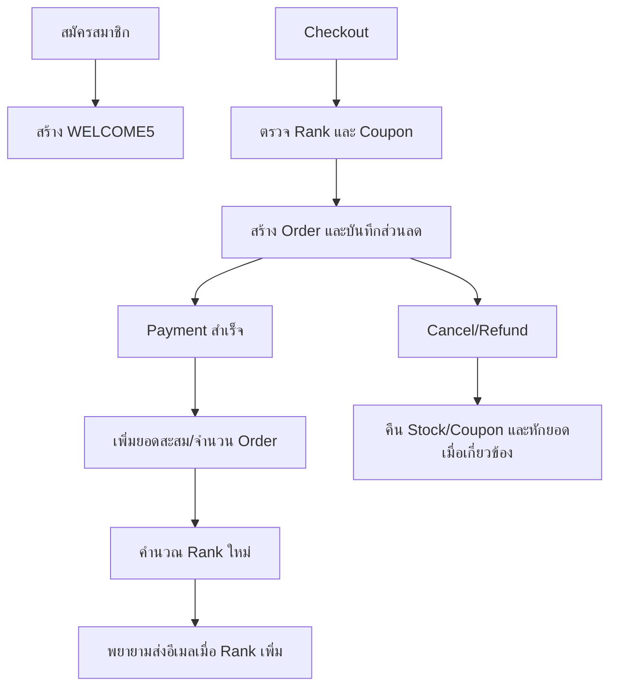

# OCCASION Loyalty & Membership Rules — Sprint 3

เอกสารนี้สรุปกติกาที่มีใน codebase ปัจจุบัน และแยกแนวคิดทางธุรกิจที่ยังต้องพัฒนาต่อออกจาก behavior ที่ใช้งานแล้ว

## กติกาที่ Implement แล้ว

### ระดับสมาชิก

| Rank | ยอดสะสมขั้นต่ำ | ส่วนลดตาม Rank | ส่งฟรีแบบ Standard เมื่อยอดถึง |
| --- | ---: | ---: | ---: |
| MEMBER | ฿0 | 0% | ฿1,000 |
| BRONZE | ฿1,000 | 3% | ฿850 |
| SILVER | ฿3,000 | 5% | ฿700 |
| GOLD | ฿8,000 | 10% | ไม่มีขั้นต่ำ |
| PLATINUM | ฿20,000 | 15% | ไม่มีขั้นต่ำ; Priority ฟรี |

ค่ากลางอยู่ที่ `server/src/config/membershipConfig.js` และการคำนวณอยู่ที่ `server/src/services/loyaltyService.js`

### การสะสมยอดและเปลี่ยน Rank

- ระบบใช้ `membership.accumulatedSpending` และ `membership.orderCount` ใน User
- เมื่อประมวลผล Order สำเร็จ ระบบเพิ่มยอดสุทธิที่เกี่ยวข้องแล้วคำนวณ Rank ใหม่
- เมื่อยกเลิก/คืนยอด ระบบสามารถหักยอดและจำนวน Order โดยไม่ให้ต่ำกว่า 0
- Rank เปลี่ยนทันทีเมื่อยอดข้าม threshold และบันทึก `rankUpdatedAt`
- Rank ที่สูงกว่า MEMBER มี `rankExpiresAt` 12 เดือน แต่ codebase ปัจจุบันยังไม่มี scheduled job ที่ตรวจและลด Rank อัตโนมัติเมื่อครบกำหนด
- เมื่อ Rank เพิ่ม ระบบพยายามส่งอีเมลแจ้งสิทธิ์ หาก SMTP ไม่พร้อม การอัปเดต Rank ยังสำเร็จและบันทึก warning

### ส่วนลดและค่าจัดส่ง

- Server คำนวณส่วนลดจาก Rank ด้วย subtotal จาก Product/Variant ในฐานข้อมูล
- หากมี Coupon ระบบคำนวณส่วนลด Coupon แล้วใช้ส่วนลดที่มากกว่าระหว่าง Rank กับ Coupon ไม่ได้นำเปอร์เซ็นต์มาบวกซ้อนกัน
- Standard shipping ใช้ threshold ตาม Rank
- Express มีราคาเริ่มต้น ฿50
- Priority มีราคาเริ่มต้น ฿100 และฟรีสำหรับ PLATINUM
- Order บันทึก `discountAmount`, `couponCode`, `membershipTierAtPurchase` และ `shippingCost`

## Coupon

### Welcome Coupon

ค่าปัจจุบันอยู่ใน `server/src/config/constants.js`:

| กติกา | ค่า |
| --- | --- |
| Code | `WELCOME5` |
| ส่วนลด | 5% |
| อายุ | 30 วัน |
| ยอดขั้นต่ำ | ฿0 |
| จำนวน | 1 ใบต่อ Customer |

- Coupon ผูกกับ `userId`
- ใช้ได้ครั้งเดียวและ claim แบบ atomic ระหว่างสร้าง Order
- หากสร้าง Order ไม่สำเร็จหรือ Order ถูกยกเลิก ระบบคืนสิทธิ์ Coupon ที่ผูกกับ Order นั้น
- การส่งอีเมล Welcome Coupon ต้องตั้ง SMTP

### General Coupon

- Admin เพิ่ม แก้ เปิด/ปิด และติดตาม General Coupon ได้
- Code ของ General Coupon ไม่ซ้ำ
- ตรวจ `isActive`, `expiresAt`, `minPurchase` และเปอร์เซ็นต์ส่วนลดก่อนใช้
- General Coupon สามารถใช้ซ้ำได้ตามสถานะและวันหมดอายุ เพราะไม่ได้ผูกกับ Customer รายเดียว

### Static Campaign Codes

codebase ยังมี static codes สำหรับ Rank/Birthday ใน `membershipConfig.js` เพื่อ fallback ระหว่าง Checkout ได้แก่ `OCCWELCOME10`, Rank VIP codes และ Birthday codes ค่าเหล่านี้ไม่ใช่ Welcome Coupon ที่ระบบสร้างให้สมาชิกใหม่ (`WELCOME5`) และควรลดการใช้งานซ้ำซ้อนในงานพัฒนาต่อ

## สิทธิประโยชน์ที่แสดงใน UI/Email

`RANK_BENEFITS` ระบุข้อความสิทธิ์ เช่น Birthday Coupon, Early Access และ VIP Care ข้อความเหล่านี้ใช้สื่อสาร benefit แต่บางรายการยังไม่มี scheduler, entitlement service หรือ redemption flow เฉพาะใน codebase จึงไม่ควรอ้างว่า automate ครบแล้ว

## Flow หลัก



## สิ่งที่ยังเป็น Future Policy

- scheduled rank expiry, retention window และ automatic yearly downgrade
- entitlement จริงสำหรับ Early Access และ VIP Customer Care
- Birthday Coupon generation ตามวันเกิด
- KPI dashboard เช่น Repeat Purchase Rate, Tier Upgrade Rate และ Redemption Rate
- financial model/CAC/gross margin ที่เชื่อมข้อมูลจริง

## Acceptance Checklist

- สมาชิกใหม่เริ่มที่ MEMBER ยอดสะสมและ order count เป็น 0
- Welcome Coupon หนึ่งใบต่อบัญชี และใช้ซ้ำไม่ได้
- ราคา ส่วนลด ค่าส่ง และยอดรวมคำนวณที่ Server
- ยอดสะสมเปลี่ยนครั้งเดียวต่อ Order และ `loyaltyProcessed` ป้องกันการประมวลผลซ้ำ
- Cancel/Refund ไม่ทำให้ยอดสะสมหรือ order count ต่ำกว่า 0
- Rank ตรงกับ threshold หลังบวกหรือหักยอด
- General Coupon ที่หมดอายุ ปิดใช้งาน หรือยอดไม่ถึงขั้นต่ำต้องถูกปฏิเสธ
- SMTP failure ไม่ทำให้การบันทึก Rank ล้มเหลว

ทดสอบกติกาหลักด้วย:

```bash
npm run test:loyalty --prefix server
npm run test:coupon --prefix server
```
