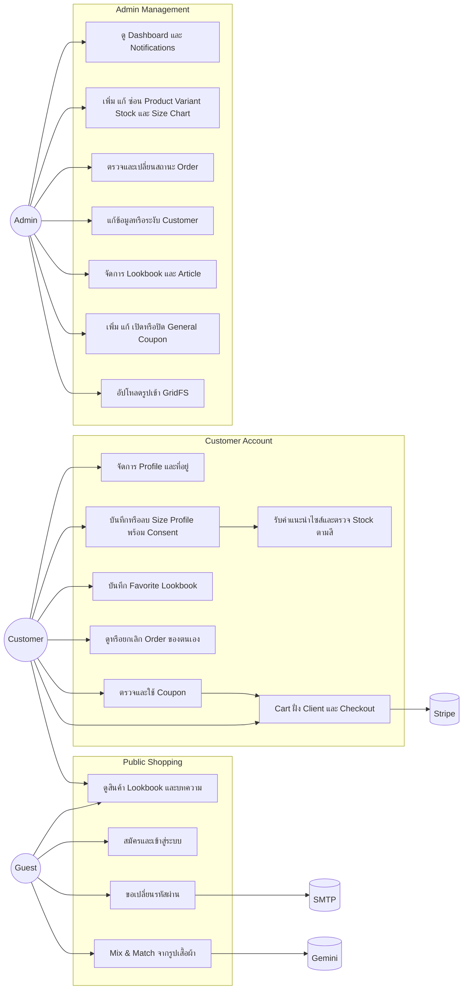

# OCCASION Use Case Diagram — Sprint 3

เอกสารนี้แสดงขอบเขตที่มีในระบบปัจจุบัน ใช้ร่วมกับ [API Specification](API_SPEC.md) และ [Database Schema](DATABASE_SCHEMA.md)

## ขอบเขตที่ไม่รวม

- Cart ไม่มี model หรือ CRUD API ฝั่ง Server
- Review ถูกถอดออกจากระบบ
- Shipping provider และ Audit Log ไม่มี integration ในระบบปัจจุบัน
- Security เช่น authentication, role authorization, validation, CORS, rate limit และ upload signature เป็นเงื่อนไขกำกับทุก use case ที่เกี่ยวข้อง

Use Case Diagram และ ERD ของ Sprint 1 เก็บเป็นหลักฐานแนวคิดเดิมแยกต่างหาก ไม่ควรใช้แทนสถานะ implementation ของ Sprint 3
